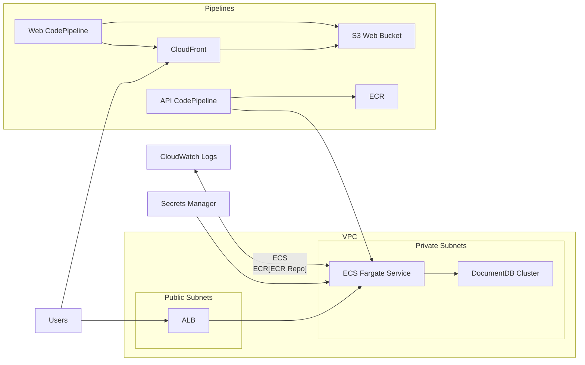

<div id="top"></div>
<!-- PROJECT LOGO -->
<br />
<div align="center">
  <a href="https://github.com/phonist/close_count">
    
  </a>

<h3 align="center">Timer Application (Close Count)</h3>

  <p align="center">
    User can create multiple timers for their events.
  </p>
</div>

<!-- ABOUT THE PROJECT -->
## About The Project


The project acts as a startup template for timer application.


This project only has one page and it is the timer page.
User can add and delete timer for their events.

### Built With
* [MongoDB](https://www.mongodb.com/)
* [Express](https://expressjs.com/)
* [React](https://reactjs.org/)
* [Node](https://nodejs.org/en/)


<!-- GETTING STARTED -->
## Getting Started
This project was developed under Docker environment. So please make sure Docker is installed.
To configure the docker environment. Please check docker-compose.yml and Dockerfile.
The project is using MERN stack.

After project setup is done, please open your browser, navigate to localhost:3000.
Register and login to the application to start creating your timers.


### Prerequisites
* Docker
* NodeJs
* React 
* MongoDB


### Installation
1. git clone https://github.com/phonist/close_count.git
2. cd close_count
3. docker-compose up -d --build
4. navigate to localhost:3000 and start your development

## Infrastructure (AWS CDK)
The infrastructure lives in `infra/cdk` and uses AWS CDK v2.

### Architecture (Mermaid)


### Prerequisites
* Node.js (CDK warns on unsupported versions; use Node 20/22 if possible)
* AWS CDK bootstrap completed for your account/region

### Environment setup
Create `infra/cdk/.env` (the scripts load this file) with:
```
ENV_NAME=dev
CDK_DEFAULT_ACCOUNT=<123456789101>
CDK_DEFAULT_REGION=ap-southeast-1
AWS_PROFILE=dev
# Optional:
# CONFIG_DIR=/abs/path/to/infra/cdk/config
```

Configs are loaded from `infra/cdk/config/${ENV_NAME}.json`.

### Bootstrap
From `infra/cdk`:
```
bash scripts/load-env.sh npx cdk bootstrap aws://123456789101/ap-southeast-1
```

### Build + synth
From `infra/cdk`:
```
npm install
npm run build
npm run synth
```

### Deploy order (dev)
Deploy in this order:
```
npm run deploy -- dev-network
npm run deploy -- dev-documentdb
npm run deploy -- dev-frontend
npm run deploy -- dev-ecs-api --require-approval never
npm run deploy -- dev-pipeline --require-approval never
```

### Common issues
* **Missing env vars**: run CDK via the scripts (they load `.env`).
* **Exports not found**: wait until `dev-ecs-api` reaches `CREATE_COMPLETE`.
* **ECS tasks cannot pull image**: push `latest` to
  `123456789101.dkr.ecr.ap-southeast-1.amazonaws.com/closecount-dev-api`.
* **EarlyValidation ResourceExistenceCheck**: delete leftover ECR repo, log group,
  or ECS cluster if you previously deleted the stack.

<!-- CONTRIBUTING -->
## Contributing

Contributions are what make the open source community such an amazing place to learn, inspire, and create. Any contributions you make are **greatly appreciated**.

If you have a suggestion that would make this better, please fork the repo and create a pull request. You can also simply open an issue with the tag "enhancement" or "bug".
Don't forget to give the project a star! Thanks again!

1. Fork the Project
2. Create your Feature Branch (`git checkout -b feature/<featureName>`)
3. Commit your Changes (`git commit -m 'add <featurename>'`)
4. Push to the Branch (`git push origin feature/<featureName>`)
5. Open a Pull Request

<!-- LICENSE -->
## License

Distributed under the MIT License. See `LICENSE.txt` for more information.


<!-- CONTACT -->
## Contact

Adrian Chong - [@twitter_handle](https://twitter.com/AdrianC50883820) - rujyi94@hotmail.com

Project Link: [https://github.com/phonist/close_count](https://github.com/phonist/close_count)
