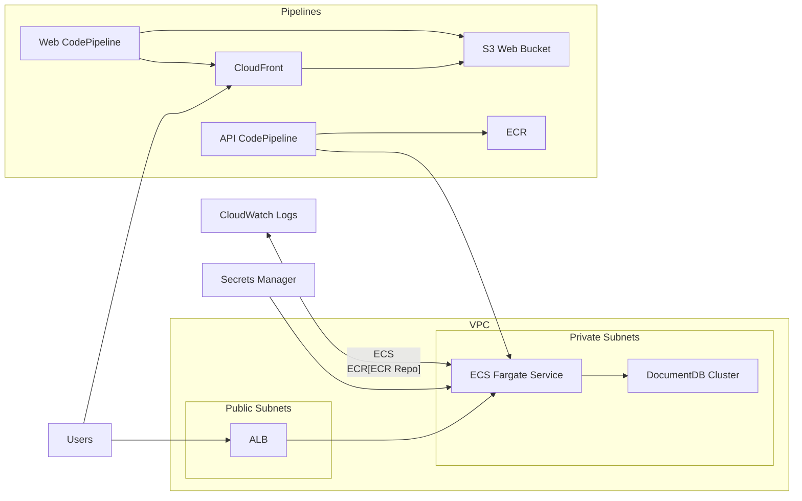

## Infrastructure (AWS CDK)
The infrastructure lives in `infra/cdk` and uses AWS CDK v2.

### Architecture (Mermaid)


### Prerequisites
* Node.js (CDK warns on unsupported versions; use Node 20/22 if possible)
* AWS CDK bootstrap completed for your account/region

### Environment setup
Create `infra/cdk/.env` (the scripts load this file) with:
```
ENV_NAME=dev
CDK_DEFAULT_ACCOUNT=<123456789101>
CDK_DEFAULT_REGION=ap-southeast-1
AWS_PROFILE=dev
# Optional:
# CONFIG_DIR=/abs/path/to/infra/cdk/config
```

Configs are loaded from `infra/cdk/config/${ENV_NAME}.json`.

### Bootstrap
From `infra/cdk`:
```
bash scripts/load-env.sh npx cdk bootstrap aws://123456789101/ap-southeast-1
```

### Build + synth
From `infra/cdk`:
```
npm install
npm run build
npm run synth
```

### Deploy order (dev)
Deploy in this order:
```
npm run deploy dev-network
npm run deploy dev-documentdb
npm run deploy dev-frontend
npm run deploy dev-ecs-api --require-approval never
npm run deploy dev-pipeline --require-approval never
```
Repeat for test/prod.

### Common issues
* **Missing env vars**: run CDK via the scripts (they load `.env`).
* **Exports not found**: wait until `dev-ecs-api` reaches `CREATE_COMPLETE`.
* **ECS tasks cannot pull image**: push `latest` to
  `123456789101.dkr.ecr.ap-southeast-1.amazonaws.com/closecount-dev-api`.
* **EarlyValidation ResourceExistenceCheck**: delete leftover ECR repo, log group,
  or ECS cluster if you previously deleted the stack.